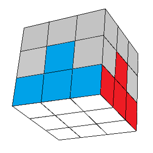
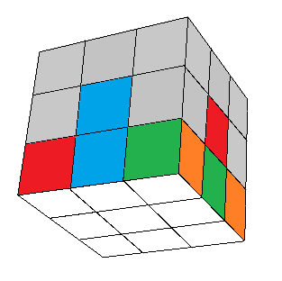
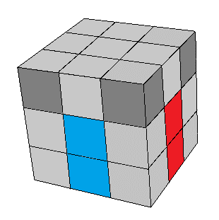
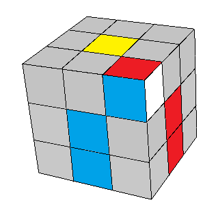
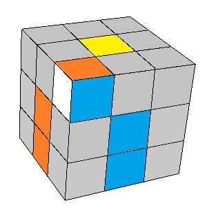
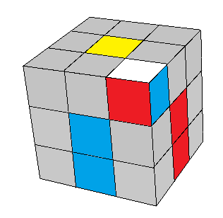
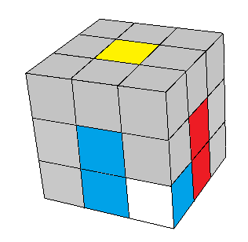
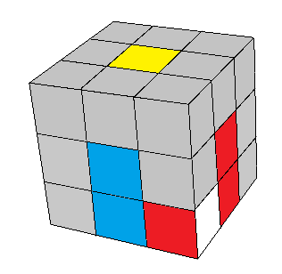
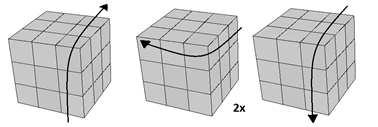
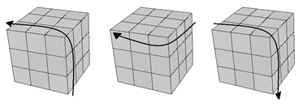

## Segundo passo - Completar uma camada

Neste passo vamos formar uma cor completa. Mas é preciso atentar também para as laterais, da mesma forma que fizemos na cruz. Os cantos devem ser posicionados no local correto em relação aos centros e aos meios da cruz. Veja abaixo.

<table class="no-border">
  <tr>
    <td>Certo</td>
    <td>Errado</td>
  </tr>
  <tr>
    <td></td>
    <td></td>
  </tr>
</table>

Vamos deixar a cor da cruz para baixo e posicionar os cantos um de cada vez. Para isso, procure por um canto que esteja na camada de cima e tenha a cor da cruz na frente ou nos lados (e não em cima):

<table class="no-border">
  <tr>
    <td></td>
  </tr>
</table>

Depois de localizar um destes cantos, veja quais cores ele tem. Então gire o lado de cima até que o canto fique logo acima da posição onde ele deve entrar. Ao mesmo tempo, gire o cubo para deixar a cor da cruz deste canto na sua direita ou esquerda (e não na frente):

<table class="no-border">
  <tr>
    <td></td>
    <td></td>
  </tr>
</table>

Se você girar a face da frente para baixo, o canto entrará em seu lugar. Porém, você perde uma das peças da cruz que já estava pronta. Para evitar isso, vamos fazer o seguinte: primeiro, separar o canto e a peça da cruz na qual ele se encaixa do restante. Depois juntamos as duas peças e por último colocamos as duas de volta no lugar:

<table class="no-border">
  <tr>
    <td style="border-right: 1px solid #000;"></td>
    <td></td>
  </tr>
  <tr>
    <td style="border-right: 1px solid #000;"></td>
    <td></td>
  </tr>
</table>

Pode acontecer de você não encontrar nenhum canto nestas situações fáceis. Neste caso, você terá uma das três situações abaixo. Precisaremos primeiro tirar o canto de seu lugar e deixá-lo numa das posições anteriores. Como podemos fazer isso? Clique no botão para ver a resposta.

<table class="no-border">
  <tr>
    <td></td>
    <td></td>
    <td></td>
  </tr>
  <tr class="hide" id="cantos_dificeis">
    <td></td>
    <td></td>
    <td></td>
  </tr>
</table>
<input type="button" value="Mostrar" class="botao" onClick="mostrar('cantos_dificeis');" />

<figure class="video_container">
  <iframe src="https://www.youtube.com/embed/LS9fVx7o2Y8" frameborder="0" allowfullscreen="true"> </iframe>
</figure>

### [Agora vamos fazer a segunda camada](segunda.html)