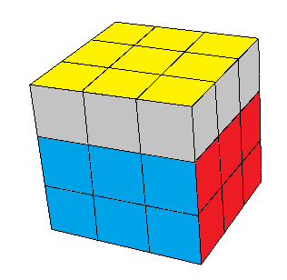
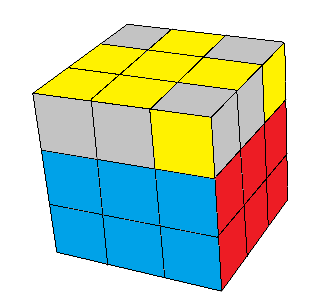
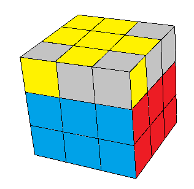
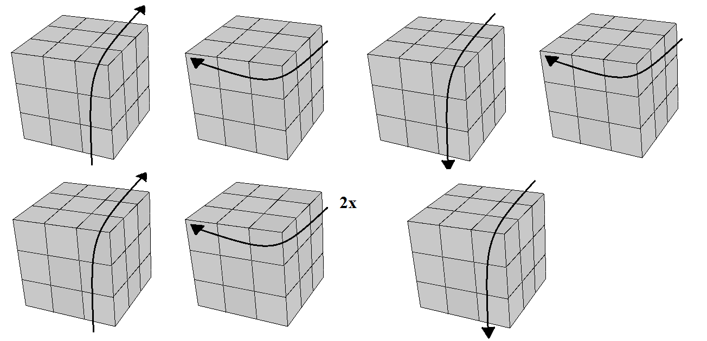
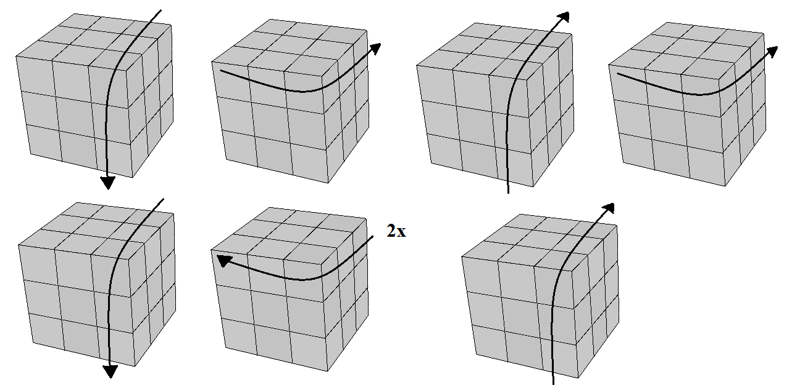
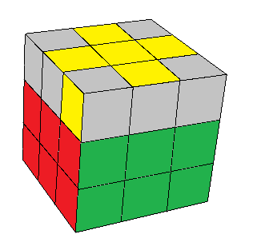

## Quinto passo - Orientar os cantos da última camada

Após fazermos a cruz, vamos agora orientar também os cantos da última camada. O cubo ficará com a cor de cima (face) totalmente pronta, mas as laterais ainda não:

Iremos aprender também dois casos bem fáceis. Assim como foi com a cruz de cima, você pode usar apenas um deles, e repetir algumas vezes, conforme necessário. Estes dois casos tem apenas <strong>um canto</strong> já orientado. Repare que as peças da última camada formam um desenho parecido com um peixe:

<table class="no-border">
  <tr>
    <td style="border-right: 1px solid #000;"></td>
    <td></td>
  </tr>
  <tr>
    <td style="border-right: 1px solid #000;"></td>
    <td></td>
  </tr>
</table>

As duas sequências são bem parecidas. A diferença é que os movimento são todos invertidos. A primeira começa com um movimento da direita para cima, e a segunda com um movimento para baixo. Depois vem um giro em cima no sentido horário, na primeira, e na segunda o giro é anti-horário. Isso acontece com todos os movimentos até o final.

--------------------

Você vai perceber que podem acontecer outros 5 casos diferentes. É possível resolvê-los diretamente, mas aqui vamos aprender uma forma mais simples. Nos casos em que houver 2 cantos orientados, ou nenhum, deixe um dos que estão errados na sua frente, ao lado esquerdo, e com a cor de cima 'apontando' para a esquerda:

Agora, faça a primeira sequência que vimos antes. Se ficou apenas um canto orientado, basta ver qual dos dois casos acima você tem e fazer a sequência correspodente. Se ainda não ficou, repita o procedimento, deixando um canto errado 'apontando' para a esquerda, conforme a última imagem. Em algumas situações você precisará fazer isso duas vezes até cair em um dos 'peixes'.

<figure class="video_container">
  <iframe src="https://www.youtube.com/embed/aTgNKIO8Ngk" frameborder="0" allowfullscreen="true"> </iframe>
</figure>

### [Falta pouco! Vamos posicionar os cantos](poscantos.html)
