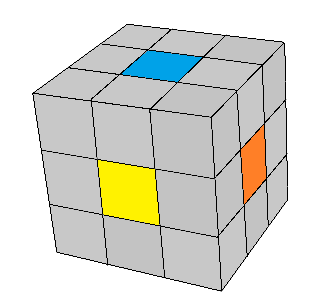
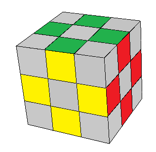
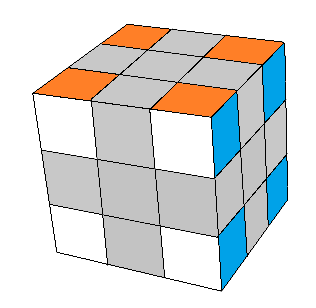
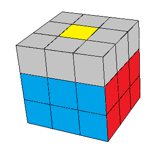
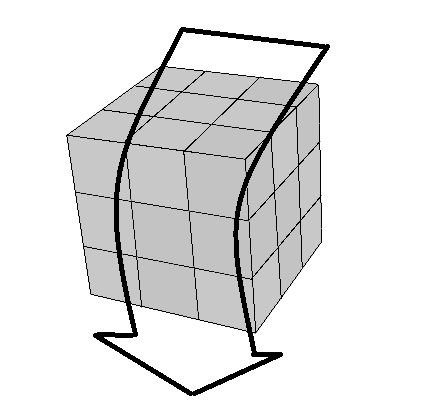
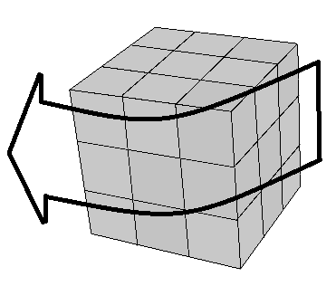

## Conceitos

#### O primeiro conceito importante é sobre os tipos de peças do cubo.

O cubo tradicional (3x3x3) tem 6 cores e 9 quadrados de cada cor. Esses quadrados não são independentes, ou seja, não é possível mover apenas um deles.

Existem 3 tipos de peças: os centros, os meios e os cantos. Veja nas figuras abaixo.

<table class="no-border">
  <tr>
    <td>Centros</td>
    <td>Meios</td>
    <td>Cantos</td>
  </tr>
  <tr>
    <td></td>
    <td></td>
    <td></td>
  </tr>
</table>

Os centros têm apenas uma cor, enquanto os meios têm duas cores e os cantos têm três. Como são peças diferentes, não é possível trocar um centro com um canto ou um meio com um canto. Cada peça tem seu lugar definido no cubo, e as peças só trocar de lugar com as do mesmo tipo.

Os centros são fixos no eixo do cubo, por meio de parafusos, então eles sempre estarão nas mesma posição uns em relação aos outros. No cubo tradicional, o centro azul está ao lado dos centros branco, vermelho, amarelo e laranja, e também está oposto ao centro verde. É o centro que determina qual deve ser a cor daquela face.

#### Camadas e faces

O cubo tem 6 faces (cores), como já vimos, e tem 3 camadas em cada eixo. Vamos resolvê-lo uma camada de cada vez, de baixo para cima:

<table class="no-border">
  <!--tr>
    <td>Centros</td>
    <td>Meios</td>
    <td>Cantos</td>
  </tr-->
  <tr>
    <td></td>
    <td></td>
    <td></td>
  </tr>
</table>

#### Movimentos do cubo

Neste tutorial vamos usar os seguintes movimentos:

<table class="no-border">
  <tr>
    <td>Lado de cima</td>
    <td>Lado de baixo</td>
    <td>Lado da direita</td>
    <td>Lado da esquerda</td>
    <td>Lado da frente</td>
  </tr>
  <tr>
    <td></td>
    <td></td>
    <td></td>
    <td></td>
    <td></td>
  </tr>
</table>

A seta irá indicar o sentido do movimento (horário ou anti-horário). Se houver um "2x" significa fazer o movimento duas vezes (meia-volta ou 180 graus). Sempre que houver uma seta fina, você deve girar apenas aquele lado do cubo. Se for uma seta larga, deve girar o cubo todo:

<table class="no-border">
  <tr>
    <td></td>
    <td></td>
  </tr>
</table>

<figure class="video_container">
  <iframe src="https://www.youtube.com/embed/8IF4Sm00DDE" frameborder="0" allowfullscreen="true"> </iframe>
</figure>

### [Vamos começar? Veja o primeiro passo](cruz.html)