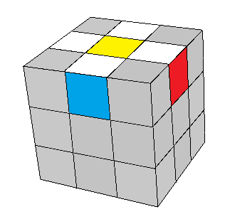

## Primeiro passo - cruz em uma cor

O primeiro passo é formar uma cruz em uma face. Pode ser em qualquer cor que você quiser. Você deve observar também as cores da lateral da cruz. Elas devem estar alinhadas com os centros correspondentes. Veja abaixo.

<table class="no-border">
  <tr>
    <td>Certo</td>
    <td>Errado</td>
  </tr>
  <tr>
    <td></td>
    <td></td>
  </tr>
</table>

Este passo é intuitivo, e talvez  um dos mais difíceis. Tente colocar uma peça de cada vez, e alinhá-la com o centro vizinho. Em alguns casos é possível aproveitar um movimento e já alinhar outra peça da cruz. Veja algumas dicas no <a href="#avancado">vídeo mais abaixo</a>.

Uma técnica mais simples é formar a cruz no centro oposto, como se fosse uma flor:

#### Formando uma flor

Nesta etapa não é necessário se preocupar com os outros centros. Desta forma, você tem mais liberdade para posicionar as peças, e depois conseguirá mais facilmente colocar cada peça da cruz no seu lugar correto.

Escolha uma cor para fazer a cruz e deixe seu centro virado para baixo. Procure por alguma peça da cruz que esteja na linha do meio, desta forma:

<table class="no-border">
  <tr>
    <td></td>
    <td></td>
  </tr>
</table>

Como você pode levar as peças brancas para o centro amarelo (cor oposta)? Tente descobrir...Depois clique abaixo para ver a resposta.

<input type="button" value="Mostrar" class="botao" onClick="mostrar('casos_faceis');" />

  Basta girar o lado direito ou esquero do cubo para cima.

  <table class="no-border">
    <tr>
      <td></td>
      <td></td>
    </tr>
  </table>

Estes dois casos são fáceis. Mas pode ser que nenhuma peça branca esteja nessa posição:

Nesse caso, como podemos deixar igual nos casos fáceis? Tente fazer e depois veja a resposta clicando no botão.

<input type="button" value="Mostrar" class="botao" onClick="mostrar('caso_dificil');" />

  Basta girar o lado da frente, em qualquer direção.

  <table class="no-border">
    <tr>
      <td></td>
    </tr>
  </table>

Uma última possibilidade é quando já existe uma peça da cruz no lugar onde outra entraria:

Para não perder a peça que já está pronta, devemos girar o lado de cima até que uma peça errada fique logo acima de onde está a peça que vamos encaixar:

#### Posicionando as peças na cruz

Depois que a flor estiver pronta, vamos colocar as peças da cruz em seus devidos lugares, uma de cada vez.

Primeiro devemos girar o lado de cima até que a cor da borda esteja alinhada com o centro correspondente:

Depois giramos aquela face duas vezes, para jogar a peça da cruz para baixo.

Repita este processo até que as 4 peças da cruz estejam em seu lugar.

<figure class="video_container">
  <iframe src="https://www.youtube.com/embed/mQjqJLn9fNI" frameborder="0" allowfullscreen="true" height="360" width="640"> </iframe>
</figure>

### [Entendido? Veja o próximo passo](camada.html)

&nbsp;

&nbsp;

&nbsp;

<h4 id="avancado">Veja algumas dicas para fazer a cruz diretamente no centro certo:</h4>

<figure class="video_container">
  <iframe src="https://www.youtube.com/embed/Y0M6NqjF5VE" frameborder="0" allowfullscreen="true" height="360" width="640"> </iframe>
</figure>

