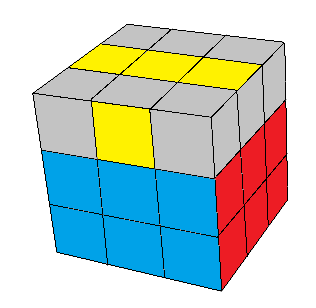

## Quarto passo - Cruz na última camada

Agora vamos fazer a última camada. Para não perder o que já está pronto, essa camada será feita em quatro partes. A primeira é formar uma cruz, ou seja, deixar todos os meios com a cor da última camada virada para cima:

Para fazer isso são apenas dois casos, e são bem simples. Procure um meio que já esteja com a cor certa para cima, e deixe do lado esquerdo. Agora observe onde está o outro meio já orientado. Ele estará atrás ou do lado direito:

<table class="no-border">
  <tr>
    <td style="border-right: 1px solid #000;"></td>
    <td></td>
  </tr>
  <tr>
    <td style="border-right: 1px solid #000;"></td>
    <td></td>
  </tr>
</table>

A única diferença entre as duas sequências é que na primeira, após o giro do lado da frente, giramos primeiro a camada de cima e depois a direita. Na segunda, primeiro a camada da direita e depois a de cima.

Você pode aprender apenas um dos casos, se quiser. É possível resolver o outro caso fazendo duas vezes a mesma sequência.

Pode acontecer também de não haver nenhum meio orientado (veja abaixo). Neste caso, basta fazer uma das duas sequências acima, e você terá um dos casos mostrados antes.

<figure class="video_container">
  <iframe src="https://www.youtube.com/embed/qFUzhhZbcik" frameborder="0" allowfullscreen="true"> </iframe>
</figure>

### [Agora vamos orientar todos os cantos da última camada](cantoscima.html)
