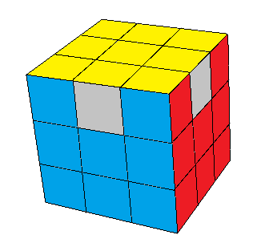
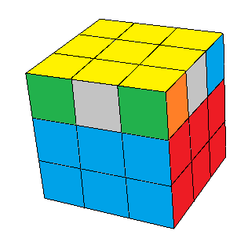
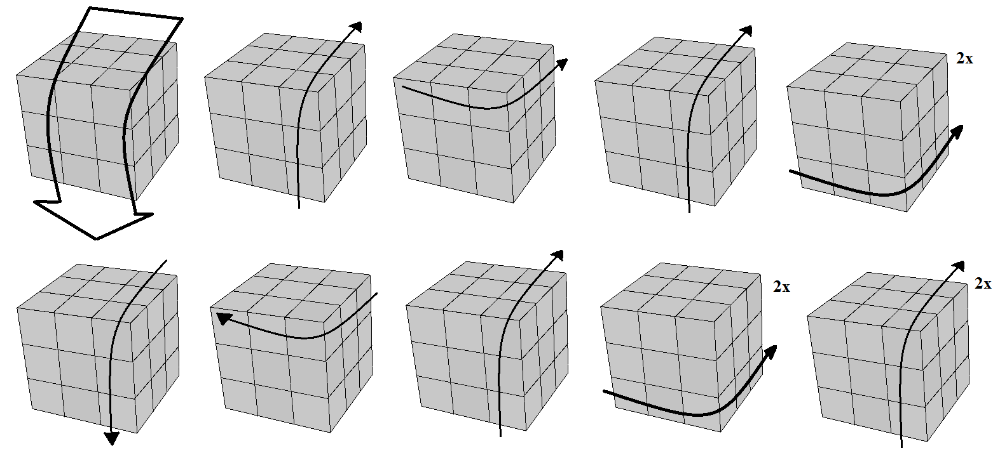
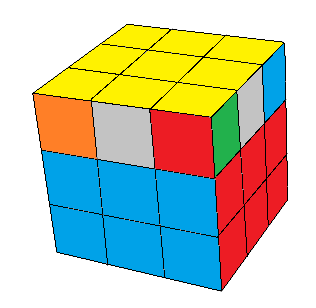

## Sexto passo - Posicionar os cantos da última camada

Agora temos a última face já pronta, mas as laterais ainda estão desalinhadas. Primeiro vamos posicionar corretamente os cantos da última camada, ficando com o cubo assim:

Vamos precisar de apenas uma sequência para isso. Primeiro procure por dois cantos que tenham a mesma cor 'apontando' para o mesmo lado.
Se os outros dois cantos também estiverem assim, todos já estão no lugar, e você pode pular para o próximo passo.
Se não estiverem, deixe os cantos que têm a mesma cor na sua frente, e faça o seguinte:

1. gire o cubo "para baixo";
2. suba o lado direito;
3. gire o lado de cima no sentido anti-horário;
4. suba novamente o lado direito;
5. gire o lado <strong>de baixo</strong> duas vezes (meia volta);
6. desça o lado direito;
7. gire o lado de cima no sentido horário;
8. suba o lado direito;
9. gire novamente embaixo duas vezes; e
10. gire o lado direito duas vezes.

<table class="no-border">
  <tr>
    <td></td>
  </tr>
  <tr>
    <td></td>
  </tr>
</table>

Se você não encontrar dois cantos com a mesma cor na mesma face (veja abaixo), temos um caso mais difícil. Nessa situação, aplique a sequência acima em qualquer posição no cubo. Em seguida você terá o primeiro caso. Posicione o cubo com os dois cantos com a mesma cor para a frente e faça a sequência de novo.

<figure class="video_container">
  <iframe src="https://www.youtube.com/embed/BWYxnymdjv4" frameborder="0" allowfullscreen="true"> </iframe>
</figure>

### [Último passo! Posicionar os meios](posmeios.html)
