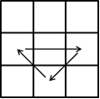
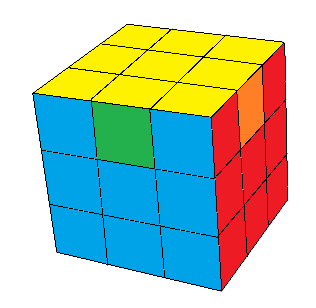

## Sétimo passo - Posicionar os meios da última camada

O último passo é posicionar os meios da última camada, para resolvermos o cubo todo. Aqui usaremos também duas sequências bem parecidas.
Primeiro procure um dos meios que já esteja resolvido. Se encontrar, deixe-o na parte de trás do cubo.

Agora observe o meio que está na frente, e veja para qual lado (direita ou esquerda) ele precisa ser movido:

<table class="no-border">
  <tr>
    <td></td>
    <td></td>
  </tr>
  <tr>
    <td></td>
    <td></td>
  </tr>
</table>

A única diferença entre os dois casos é o sentido do giro da camada de cima. Ele é o mesmo que o meio da frente precisa fazer.

------------------------------

Se não encontrar nenhum meio já no lugar certo, você terá um dos casos abaixo:

<table class="no-border">
  <tr>
    <td></td>
    <td></td>
  </tr>
</table>

Para resolver, faça uma das duas sequências acima. Não importa a posição do cubo. Depois você terá um meio resolvido, e poderá aplicar a sequência conforme vimos antes.

<figure class="video_container">
  <iframe src="https://www.youtube.com/embed/ur6VzGV4PtI" frameborder="0" allowfullscreen="true"> </iframe>
</figure>

### PRONTO! Seu cubo está resolvido!

É muito importante agora treinar tudo que aprendeu. Já vimos que não é difícil, mas requer paciência e prática. Se estiver com dúvida, volte aos passos anteriores. Sugiro treinar um até ficar bem firme dele, e depois passar para o próximo. Assim você conseguirá resolver o cubo, não importa como ele esteja.