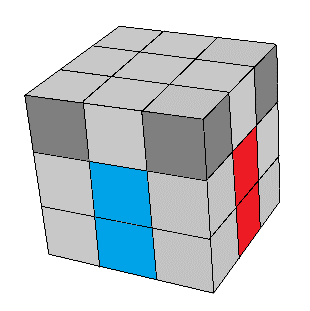

## Terceiro passo - Completar a camada do meio

Neste passo vamos formar a segunda camada (ou andar) do cubo. Da mesma forma, é preciso atentar para os centros e a camada que já está pronta. Ao final o cubo ficará assim:

Vamos manter a cor da cruz para baixo e posicionar os meios da segunda camada, um de cada vez. Para isso, procure por um meio que esteja na camada de cima e pertença à segunda camada. Dica: ele não terá a cor da camada de cima.

<!--table class="no-border">
  <tr>
    <td></td>
  </tr>
</table-->

Depois de localizar um destes meios, veja quais cores ele tem. Então gire o lado de cima até que o meio fique alinhado com um dos centros. Ao mesmo tempo, gire o cubo para deixar a cor deste centro na sua frente:

<table class="no-border">
  <tr>
    <td></td>
    <td></td>
  </tr>
</table>

Agora observe para qual lado este meio precisa ir, direita ou esquerda? A sequência de movimentos será:
1. girar a face de cima no sentido <strong>oposto</strong> ao que o meio deve ir;
2. subir o lado no qual o meio deve entrar;
3. voltar a camada de cima;
4. voltar a camada do lado;

Depois disso você terá tirado um canto da primeira camada, mas agora ele está junto com o meio corresponte. Nos próximos movimentos vamos encaixar os dois juntos em seus lugares. Primeiro gire o cubo, deixando a cor da primeira camada na frente. Depois faça:
5. girar a face de cima;
6. subir o aldo no qual o meio vai entrar;
7. voltar a camada de cima;
8. voltar a camada do lado.

<table class="no-border">
  <tr>
    <td style="border-right: 1px solid #000;"></td>
    <td></td>
  </tr>
  <tr>
    <td style="border-right: 1px solid #000;"></td>
    <td></td>
  </tr>
</table>

Pode acontecer de você não encontrar nenhum meio nestas situações fáceis. Neste caso, você terá uma das situações abaixo. O meio está em seu lugar, mas invertido, ou então está no lugar de outro da segunda camada. Para resolver é simples. Basta colocar qualquer um dos meios que estão em cima naquele lugar. O meio que queremos irá sair, e depois colocamos no seu lugar certo.

<table class="no-border">
  <tr>
    <td></td>
    <td></td>
  </tr>
</table>

Repita o procedimento até colocar as 4 peças em seu lugar correto na camada do meio.

<figure class="video_container">
  <iframe src="https://www.youtube.com/embed/W_RUx5lvrOA" frameborder="0" allowfullscreen="true"> </iframe>
</figure>

### [Veja o próximo passo](cruzcima.html)